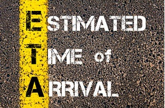

# Estimated Time of Arrival

## Problem Statement
### Economies are better when logistics is efficient and affordable.

This project is to predict the estimated time of delivery of orders, from the point of driver pickup to the point of arrival at final destination.

The solution will enhance customer communication and improve the reliability of its service; which will ultimately improve customer experience. In addition, the solution will enable to realise cost savings, and ultimately reduce the cost of doing business, through improved resource management and planning for order scheduling.

[Click to view the project](https://github.com/rsaadiq/Estimated_time_of_apprival-/blob/master/ETA%20Prediction.ipynb)
